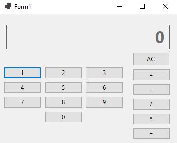

# projeto_Calculadora-CSharp
Calculadora desenvolvida utilizando Windows Forms e C#. 

## Autor
- [@vitor-matheus1999](https://www.github.com/vitor-matheus1999)

## Apêndice
Para utilizar a calculadora é preciso realizar o download do arquivo completo e seguir o caminho:
bin\Debug\net6.0-windows
Em seguida selecionar o arquivo executável "Calculadora".

## Features
- Reiniciar a calculadora;
- Realizar cálculos contínuos apenas clicando nos operadoradores matemáticos;
- Excluir zero a esquerda;
- Substituir o número zero caso aja apenas esse número na cálculadora;
- Apresentar mensagem de erro de divisão por zero.

## Disclairmer
<i> Primeiramente, o código apresenta de forma "pouco produtiva" a maneira com que poderia ser criado os métodos, funções, propriedes e atributos. A criação de uma classe que tratasse as funcionalidades e exceções da calculadora, tornaria o código "mais limpo" no arquivo "Form1.cs". Porém, por conta do tempo em que tive para construir esse projeto, acabei focando em construir todo o código  nesse unico arquivo e explicar aqui no "Readme" de forma mais minuciosa.<i>

---

## Sobre o projeto

  Esse projeto foi um exercício proposto por um professor da faculdade que estou cursando. O foco desse projeto é a construção de uma calculadora simples que possa realizar equações matemáticas de soma, subtração, múltiplicação e divisão. Sendo também tratado as possíveis exceções e erros, que serão mais detalhados no decorrer do Read.md, que podem vir a ocorrer quando a calculadora for utilizada.

## Breve apresentação da calculadora

A calculadora segue um design simples, seguindo o exemplo da calculadora padrão utilizado pelo sistema Windows:

  

Porém, a calculadora que é utilizada pelo windows contém o botão que insere "virgula"/"ponto" para expressar um número decimal na equação, botão esse que não contém em minha calculadora. Todavia, ire inserir o botão em versões futuras do projeto para deixar a calculadora mais "completa".

No total, a calculadora possui 16 botões:
* Sendo 10 deles números inteiros de 0 a 9, para  montar o valor das variáveis tratadas nos cálculos;
* 4 botões referentes aos operadores matemáticos de soma (+), subtração (-), múltiplicação (*) e divisão (/);
* 1 botão de igual para representar o resultado obtido pelo cálculo realizado;
* 1 botão "AC" ou "All Clear" para reiniciar a calculadora.

Em cima dos botões,o display atuará por apresentar os números e resultador obtidos pela calculadora.

Para que os números sejam lidos, e os cálculos realizados, é preciso que o usuário clique nos botões que constam na calculadora. Clicando nos números com o mouse, a cálculadora apresentará em seu display o número desejado pelo usuário.

## Sobre o código e a lógica utilizada 

A lógica de uma calculadora simples é básica; reunir duas variáveis, utilizando um operador matemático para definir o tipo de cálculo que será realizado e logo em seguida, depois de realizar a conta, apresentar o resultado obtido.

